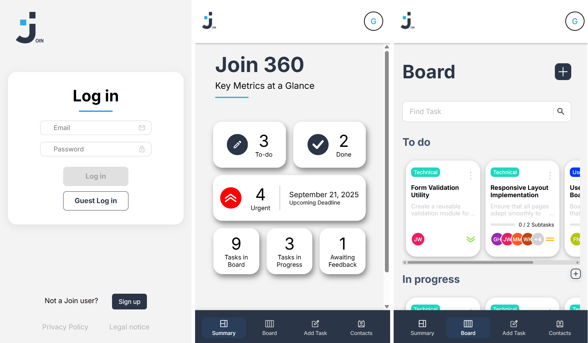
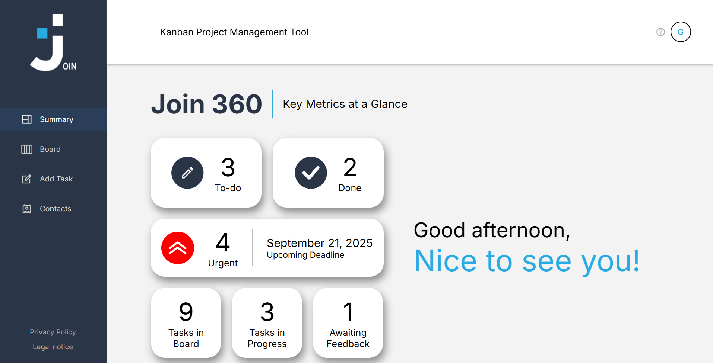

# Join

This project is a web-based task manager and similar to the Kanban system. With Join you can create, organize, and track all tasks for your project.
Join was generated using [Angular CLI](https://github.com/angular/angular-cli) version 19.2.12. The Firebase CDKs for authentication and the firestore database were used to handle all upcoming data.

## 🪄 Features

👤 Login and User registration. In order to use the board, you need to log in first. You can either register or use the guest log in account.

📅 Task board. The board represents your projects tasks and contains four default lists: to do, in progress, await feedback and done.

📝 Summary board. The summary gives an overview about all current tasks and the next upcoming date.

📒 Contact page. Here, you can add or edit contacts to collaborate on your projects.

🧭 Single-Page Routing for easy navigation.

❓ Help: A dedicated Help page with details about the task manager join and how it works.

⚖️ Impressum & Privacy: A dedicated Impressum page with legal information and privacy details.

💾 All data are stored in the firestore database.

## 📸 Screenshots

Mobile phone preview:


Desktop preview:


## ⚙️ Technologies Used

- Angular version 19.2
- TypeScript
- SCSS for styling
- Firestore Database & Firebase Authentication
- Material Design CDKs for Drag & Drop functionality

## 🚀 Getting Started

1. Clone the repository.
2. Install dependencies: 
```bash
npm install
```
3. Start the development server:
```bash
ng serve
```
4. Once the server is running, open your browser and navigate to `http://localhost:4200/`. The application will automatically reload whenever you modify any of the source files.

## 💡 Code scaffolding

Angular CLI includes powerful code scaffolding tools. To generate a new component, run:

```bash
ng generate component component-name
```

For a complete list of available schematics (such as `components`, `directives`, or `pipes`), run:

```bash
ng generate --help
```

## 🛠️ Building

To build the project run:

```bash
ng build
```

This will compile your project and store the build artifacts in the `dist/` directory. By default, the production build optimizes your application for performance and speed.

## Additional Resources

For more information on using the Angular CLI, including detailed command references, visit the [Angular CLI Overview and Command Reference](https://angular.dev/tools/cli) page.

## 💡To-Dos / Ideas

- [ ] 🖼️ Upload option for user profile or tasks

   
## 🤓 Author

Created by Michelle Puschkarow. <br>
If you like this project, feel free to give it a ⭐️ or contribute!